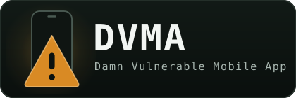

<div align="center">



# Damn Vulnerable Mobile App

**A single-codebase, intentionally vulnerable Flutter app that builds to real native iOS and Android binaries for mobile security training and pentest practice.**

</div>

<!-- BADGES_START - stripped from the Hugo docs build; see .hugo/scripts/build_docs.py -->
<p align="center">
  <a href="https://github.com/cpeoples/dvma/actions/workflows/ci.yml"></a>&nbsp;
  <a href="https://cpeoples.github.io/dvma/"></a>&nbsp;
  <a href="LICENSE"></a>&nbsp;
  <a href="https://flutter.dev"></a>&nbsp;
  &nbsp;
  &nbsp;
  <a href="config/registry/categories"></a>&nbsp;
  <a href="https://mas.owasp.org/MASVS/"></a>&nbsp;
  <a href="https://owasp.org/www-project-mobile-top-10/"></a>&nbsp;
  &nbsp;
  <a href="https://genai.owasp.org/"></a>
</p>
<!-- BADGES_END -->

> [!WARNING]
> **For authorized training and testing use only.** DVMA is deliberately
> insecure. **Do not** deploy it to production infrastructure, publish it to
> app stores, or run it on devices holding real data. It exists so security
> engineers, pentesters, and students can practice against realistic mobile
> vulnerabilities in a controlled environment. You are responsible for using it
> only where you are authorized to do so. (Same convention as DVIA / DVWA /
> DVAC.)

DVMA ships **218 intentionally-vulnerable modules** organized by OWASP MASVS
category, each mapped to the **OWASP Mobile Top 10 (2024)**, **MASVS/MASTG**,
and **CWE**, plus a novel **AI/ML assistant**, **agentic AI**, and an
**AI × mobile** (LLM-meets-IPC/WebView) module set mapped to the **OWASP Top 10
for LLM/GenAI Applications (2025)** and the **OWASP Top 10 for Agentic AI
Applications (2025)**.

**Who it's for:** mobile security engineers, pentesters, and researchers who
want a realistic native target to practice against; instructors and students
learning MASVS/MASTG; and tool authors validating scanners against known,
standards-mapped weaknesses. Contributors add new modules through a single
registry entry (see [Contributing](#contributing)).

📖 **Docs site:** the full, browsable catalog builds from a single source of
truth, see [Documentation](#documentation).

## Quickstart (5 minutes)

Already have [Flutter](https://cpeoples.github.io/dvma/getting-started/installing-flutter/)
set up? Clone, enable every module with the `dev` flavor, and run on a booted
emulator/simulator or a connected device:

```sh
git clone https://github.com/cpeoples/dvma.git && cd dvma
flutter pub get
flutter run --dart-define-from-file=config/flavors/dev.json
```

Want to drive every module automatically instead of tapping through by hand?
The one-shot Appium harnesses build the app, run the full walk, and collect
on-device evidence (they need **[Node.js](https://nodejs.org) ≥ 18**, e.g.
`brew install node`, for Appium/WebdriverIO):

**Android** (physical device or emulator; macOS/Linux):

```sh
automation/scripts/appium_run_android.sh
```

**iOS** (Simulator; macOS):

```sh
automation/scripts/appium_run_ios.sh
```

First run needs Appium 2 and its drivers installed (a one-time
`npm i -g appium` + `appium driver install`), and the harness environment
variables are documented in
**[automation/README.md](automation/README.md#install)** — the full setup and
run reference for the Appium / Espresso / XCUITest suites.

That's the whole loop. For depth, device setup, build flavors, adding modules,
rooting/jailbreak, and the full automation guide, head to the browsable
**[docs site](https://cpeoples.github.io/dvma/)**:

- **[Getting Started](https://cpeoples.github.io/dvma/getting-started/)**, install Flutter, build, install on a device/emulator, flavors, testing, automation
- **[Root & Jailbreak](https://cpeoples.github.io/dvma/device-access/)**, root (Android/Magisk), jailbreak (iOS/Dopamine), and verifying extracted artifacts
- **[Vulnerabilities](https://cpeoples.github.io/dvma/vulnerabilities/)**, the browsable module catalog (OWASP/MASVS/CWE mapped)
- **[Architecture](https://cpeoples.github.io/dvma/architecture/)**, how the Flutter UI, native host, and companion attacker fit together

## Contents

- [Quickstart (5 minutes)](#quickstart-5-minutes)
- [What's inside](#whats-inside)
- [Documentation](#documentation)
- [Contributing](#contributing)
- [Project structure](#project-structure)
- [License & disclaimer](#license--disclaimer)

## What's inside

The vulnerability set is a **floor, not a ceiling**, the registry
(`config/registry/`, split into `meta.yaml` + one `categories/<id>.yaml` per
category) is an append-only catalog, so new items get a home under their
category without restructuring anything.

| Category | OWASP Mobile | Examples |
| ---------- | -------------- | ---------- |
| Storage | M9 | plaintext prefs, Keychain/Keystore misuse, clipboard/log/screenshot leakage, external-storage & in-memory secrets, Keychain state-integrity manipulation, Keychain access-group authorization confusion, **backup-archive integrity tampering**, **local security-state integrity tampering**, **auth-state rollback/restore**, **sensitive data in crash reports** |
| Crypto | M10 | MD5/SHA1/DES/RC4/ECB, hardcoded keys, insecure RNG, weak KDF |
| Auth | M3 | weak sessions, bypassable biometrics, JWT `alg:none`, client-side authz, passkey/WebAuthn flaws (weak attestation, origin/RP-ID binding, credential exfiltration, fallback downgrade, assertion replay / sign-count, challenge reuse, UV-enforcement bypass, step-up bypass, credential-management authz, session fixation, third-party pairing authz), username enumeration, reset-token & backdoor, cross-app OTP leak, deep-link auth bypass, biometric result not bound to operation, credential-provider release authorization failure, multi-account isolation failure, identity-credential / mDL presentation not bound to session |
| Network | M5 | cleartext, weak TLS, bypassable pinning, accept-all trust manager |
| Platform | M4 | WebView JS-bridge RCE, deep-link hijack, exported components, zip-slip, FileProvider traversal, dynamic-code-loading RCE, overlay phishing, intent arg-injection RCE, deep-link→WebView nav, exported→arbitrary URL/activity, implicit-intent data leak, PendingIntent provenance confusion, in-app browser UI spoofing, cross-app scripting, GRANT_URI_PERMISSIONS abuse, custom-URL-scheme authorization, WKWebView untrusted-URL→local-file read, confused-deputy intent validation, SSRF via URL/media handler, QR→URL with no validation, proximity-transfer (AirDrop/Quick Share) unsafe parsing, Shortcuts symlink/path sandbox escape, exported-component state manipulation, ContentProvider filename traversal, App-Intent parameter → privileged action, `content://`→ContentResolver confused deputy, AccessibilityService privilege abuse, notification-listener authorization bypass, background-activity-launch abuse, clipboard unauthorized-write integrity tampering, clipboard → privileged-action injection, authorization based on mutable resource state, telephony / phone-account capability abuse, document-picker trusted-file confusion, system-surface → privileged App Intent exposure, cross-profile (work/personal) data & capability leakage, unauthenticated local/loopback service (+DNS-rebinding), dynamic (runtime) BroadcastReceiver exposure, privileged Service binding / Binder-interface exposure, Activity task-stack / affinity hijacking (StrandHogg-style), activity-alias exposure, platform-version security fallback, default-role / role-holder confusion, persistent URI-grant capability abuse, ClipData URI-grant leakage, file-descriptor capability leakage, ordered-broadcast result injection, app-widget / RemoteViews action injection, notification-action / trampoline authorization bypass, custom / signature permission squatting, Handoff / NSUserActivity injection, Universal-Link / AASA associated-domain confusion, App Clip invocation injection, Android capability-composition chain (notification→PendingIntent→receiver→Binder→transfer), iOS capability-composition chain (Universal Link→App Intent→security-scoped file→Contacts export) |
| Code quality | M7 | debuggable release, no obfuscation, leaked stack traces, CVE dep |
| Resilience | M7 | root/Frida/emulator/tamper detection with trivial bypasses, TOCTOU |
| Supply chain | M2 | malicious SDK, typosquatting, unsigned build artifacts, insecure Firebase/cloud config, missing/stale SBOM, silent SDK auto-update, dependency confusion, vulnerable-SDK exported component |
| Privacy | M6 | no-consent data access, no ATT prompt, PII in analytics, installed-app enumeration fingerprint, cross-app browser-history access, notification disclosure via alternate surface, lock-state confusion data exposure, privacy-control alternate-path bypass, system-assistant locked-device capability abuse |
| Input validation | M4 | unsafe deserialization, unvalidated intent extras, unsafe media/image decoding, deep-link regex DoS, protected-data access via input-validation confusion |
| AI/ML | M4 + LLM Top 10 | prompt injection (incl. invisible-unicode), RAG poisoning, hidden context exposure, on-device model extraction, key/model leakage |
| Agentic AI | M4 + Agentic Top 10 | agent memory poisoning, MCP/tool-description poisoning, confused-deputy tool misuse, insecure inter-agent comms, MCP open_url → arbitrary Android intent |
| AI × mobile | M4 + LLM Top 10 | untrusted mobile input (deep link/clipboard/QR) → LLM prompt, AI output → WebView XSS/local-file read, AI output → intent/URL navigation, AI output → tool/command injection, accessibility-tree → indirect prompt injection |
| Native bridge | M4 | JS-bridge callback-ID injection, cross-origin iframe → native bridge (no main-frame/origin check) → token theft, JS bridge exposing a privileged native API, QR/NFC → privileged action without confirmation, exported BroadcastReceiver data spoofing, WebView origin confusion → local-only IPC, WebView JS injection + SSL-validation bypass, embedded Mini-App secret exposure, WebView SOP/CSP disabled, shared-WebView mini-app isolation failure, provider-controlled metadata → plugin filesystem traversal (Flutter/RN/Cordova/Capacitor plugin boundary), WebView cleartext / mixed-content transport downgrade, WebView Safe Browsing disabled, WebView remote debugging enabled in production, WebView URL-loading (`shouldOverrideUrlLoading`) policy confusion |
| System provider | M4 | **Mobile capability-broker abuse** - an app that becomes a privileged system actor is a broker between an untrusted actor and a privileged capability: provider activation abuse (a11y / notification-listener / VPN / IME / device-admin / call-screening / phone-account / MediaProjection / credential-provider enablement as the boundary), MediaProjection / screen-capture authorization bypass, custom-keyboard / IME input interception, privileged IME **event injection**, companion-device pairing/capability confusion, Device Policy / MDM capability abuse, VPN provider trust-anchor / tunnel MITM, sensitive notification -> privileged AI processing, Assist / screen-context -> AI action exposure, App Group shared-container amplification, extension-activation != input-authorization, lock-screen control action authorization |

## Documentation

The docs site is generated from the same registry (mirroring the
ansible-security-scanner pipeline). Build it locally:

```sh
python3 .hugo/scripts/build_docs.py        # registry + docs/ -> .hugo/content/
cd .hugo && hugo server                     # preview at http://localhost:1313
```

CI builds and deploys it to GitHub Pages on every push to `main`. The site is
generated from committed source, the module catalog from the registry
(`config/registry/`), the guides from `docs/` (`docs/getting-started/`,
`docs/device-access.md` + `docs/device-access/`, `docs/architecture.md` +
`docs/architecture/`), and this README's intro, so nothing drifts. The Manual
Testing checklist is generated from each module's `manual_test:` registry field
(split per platform), so it never drifts from the catalog either.

For how the three pieces (Flutter UI, native Android host, and the companion
attacker app) fit together, and how every module produces a real,
device-extractable artifact, see
[`docs/architecture.md`](docs/architecture.md) (published as the site's
**[Architecture](https://cpeoples.github.io/dvma/architecture/)** section, with a
system diagram plus child pages for the native bridges, companion attacker, and
real-artifact guarantee).

## Contributing

Add a vulnerability module with a single registry YAML entry - the generator
produces the app code, docs, manifest, and manual-testing checklist. Standards
tags (`masvs` / `cwe` / `maswe` / `owasp_mobile`) are **required and enforced**
by the generator/CI.

Validate everything locally before opening a PR with one command:

```sh
make check      # format, analyze, generator drift, app-id sync, registry schema
make test       # the above + the full Dart unit/widget suite
```

Install the commit-time gate once (`pip install pre-commit && pre-commit
install`) and the same checks run automatically on every commit. See
[`CONTRIBUTING.md`](CONTRIBUTING.md) for the full walkthrough, required fields,
the component glossary, what each CI job proves, and a troubleshooting table.

### What CI runs on your PR

| Job | Runner | Proves |
| ----- | -------- | -------- |
| Lint & validate (pre-commit) | Ubuntu | Formatting, lint, registry schema, secret scan, shellcheck, actionlint |
| Analyze & unit/widget tests | Ubuntu | Generator/app-id in sync, `flutter analyze`, `flutter test` |
| Integration tests (Android emulator) | Ubuntu | The full `integration_test/` walk on a real emulator |
| Build smoke (debug APK) | Ubuntu | The app compiles to an Android binary |
| Build companion attacker | Ubuntu | The cross-app demo companion still compiles |
| Compile Android instrumentation | Ubuntu | The Espresso/UiAutomator harness still compiles |
| Compile iOS XCUITest harness | macOS | Runner + RunnerUITests compile (no signing) |

iOS simulator integration and the iOS build smoke are available on demand
(`workflow_dispatch`); macOS runners are slower/costlier so they are not part of
the required PR gate. Tagged releases (`v*`) run a separate signing workflow.

## Project structure

```text
dvma/
├── config/                               # ALL configuration (flavors, analysis, CI, registry)
│   ├── flavors/                          # dart-define flavor files
│   └── registry/                         # SINGLE SOURCE OF TRUTH (meta.yaml + categories/<id>.yaml + schema/)
├── lib/
│   ├── app_config.dart                   # parses the active flavor
│   ├── vulnerability_registry.dart       # GENERATED catalog
│   ├── core/                             # theme, home UI, shared widgets, module router (generated)
│   └── modules/                          # one leaf folder per vulnerability, by MASVS category
├── tool/generate.dart                    # registry/router/stub/manifest generator + validator
├── test/                                 # unit + widget tests
├── integration_test/                     # e2e regression suite + app_test.dart
├── companion/dvma-attacker/              # standalone companion app for cross-app demos
├── automation/                           # Appium / Espresso / XCUITest suites + vuln_manifest.json
├── docs/                                 # per-vuln docs + guides (source for the site)
├── .hugo/                                # docs site (relearn theme + build_docs.py)
├── .github/workflows/                    # CI, docs deploy, release
├── Makefile                              # `make check` = the one local validation command
├── scripts/check.sh                      # thin wrapper around `make check`
└── .pre-commit-config.yaml               # commit-time quality gate
```

## License & disclaimer

Released under the [MIT License](LICENSE).

**DVMA is intentionally vulnerable software for authorized security training and
pentest practice only.** Do not deploy it to production infrastructure or app
stores. The authors accept no liability for misuse.
