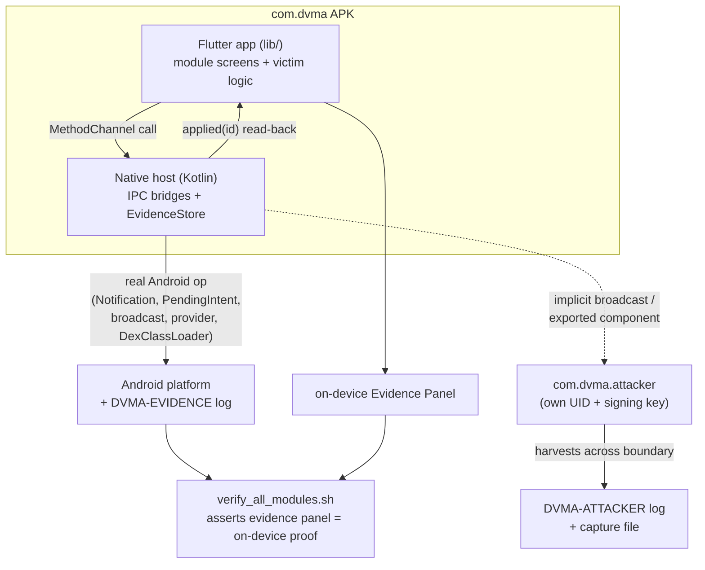

# Architecture

> **Authorized training/testing use only.** DVMA is intentionally vulnerable.
> See the root README disclaimer.

DVMA looks like one app, but it is deliberately built from **three cooperating
pieces**. This separation is what lets every module produce a *real,
device-extractable artifact*, not an in-app simulation.

## The three pieces

| Piece | Package / build | Role |
| ------- | ----------------- | ------ |
| **Flutter app** (`lib/`) | `com.dvma` (Dart UI + tests) | The vulnerability module *screens*, the UI you tap through, plus the victim-side logic. One leaf folder per module under `lib/modules/<category>/<id>/`. |
| **Native Android host** (`android/…/kotlin/com/dvma/`) | same `com.dvma` APK | Kotlin that hosts the Flutter engine **and** exposes the real Android platform / IPC surfaces Dart cannot reach on its own (Notifications, PendingIntents, exported components, ContentProviders, DexClassLoader, an enablable IME / AccessibilityService, …). |
| **Companion attacker** (`companion/dvma-attacker/`) | `com.dvma.attacker`, its **own** UID and signing key | A *second, standalone app* that crosses the Android process/trust boundary to actually exploit DVMA's cross-app vulnerabilities. One app cannot attack itself across an IPC boundary, so the adversary has to be a genuinely separate app. |

## How it fits together

## Dig deeper

- **[Native bridges](native-bridges/)**, how the Flutter and Kotlin halves talk
  over `MethodChannel`s, and how the native op + `EvidenceStore` read-back works.
- **[Companion attacker](companion-attacker/)**, why an adversary needs its own
  app, and the cross-app modules it exploits.
- **[The real-artifact guarantee](real-artifact-guarantee/)**, how every module
  produces a device-extractable artifact, end-to-end verification, and the iOS
  evidence tiers.
